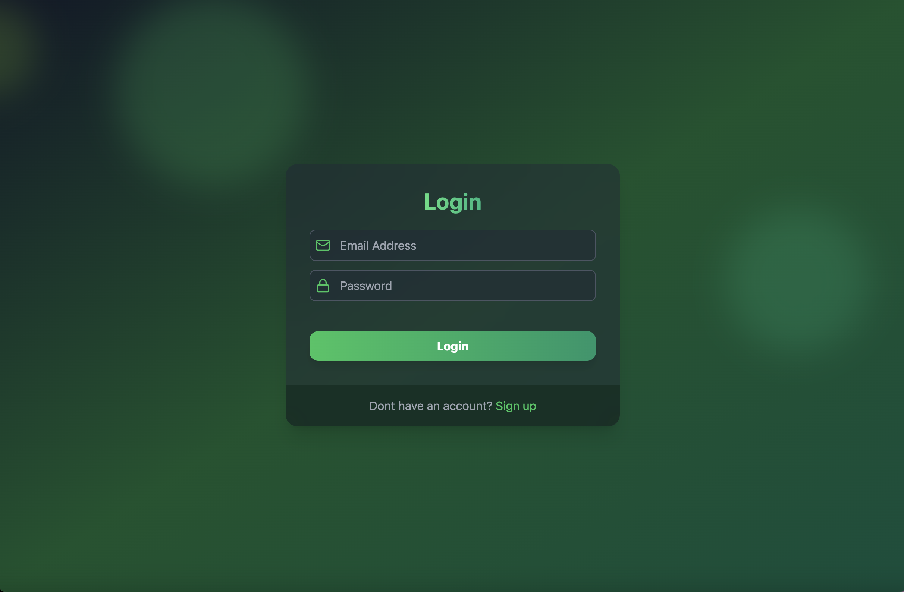

## Technologies Used

### Front-End:
- **React.js**: A JavaScript library for building user interfaces.
- **Tailwind CSS**: A utility-first CSS framework for styling.
- **Framer Motion**: A library for animations and gestures.

### Back-End:
- **Node.js**: A JavaScript runtime for server-side development.
- **Express.js**: A web application framework for building APIs and web servers.
- **Mongoose**: An ODM (Object Data Modeling) library for MongoDB.
- **Mailtrap**: A service for testing and debugging email functionality.

## Environment Variables

| Variable               | Description                                  | Example                        |
|-------------------------|---------------------------------------------|--------------------------------|
| `MONGO_URL`            | MongoDB connection string                    | `mongodb://127.0.0.1:27017/dbName` |
| `SECRET_ACCESS_TOKEN`  | Secret key for signing access tokens         | `my_secret_access_token`      |
| `SECRET_REFRESH_TOKEN` | Secret key for signing refresh tokens        | `my_secret_refresh_token`     |
| `NODE_ENV`             | Application environment                      | `development`                 |
| `MAILTRAP_TOKEN`       | Mailtrap API token                           | `your_mailtrap_token`         |
| `MAILTRAP_WELCOME_UUID`| UUID for the welcome email template          | `template_uuid_here`          |
| `CLIENT_URL`           | URL of the client application                | `http://localhost:5000`       |

